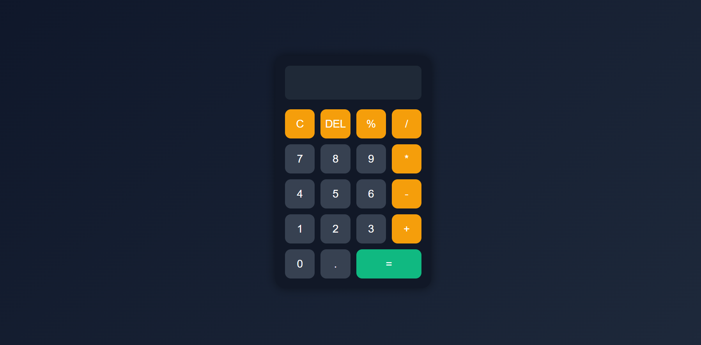

# 🧮 JavaScript Calculator

A modern and responsive calculator web application built using **HTML**, **CSS**, and **JavaScript**.

---

## 🚀 Features

✅ Basic Arithmetic Operations  
✅ Percentage Calculation  
✅ Clear & Delete Functions  
✅ Responsive Design  
✅ Modern Dark UI  
✅ Smooth Button Hover Effects  

---

## 🛠️ Technologies Used

- HTML5
- CSS3
- JavaScript

---

## 📸 Project Screenshot

---

## 🌐 Live Demo

https://suman1-panda.github.io/javascript-calculator/

---

## 📂 GitHub Repository

https://github.com/Suman1-panda/javascript-calculator

---

## 👨‍💻 Author

**Suman Panda**
